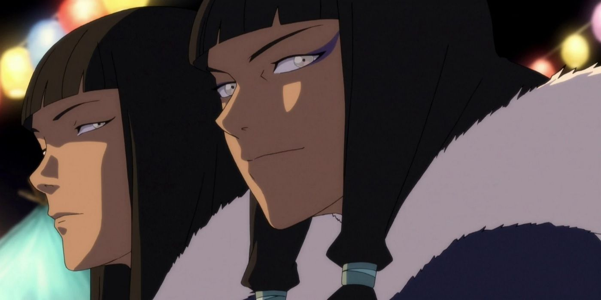

---
title: Character arcs of Avatar
stage: seedling
feature: unclehiro and zuko.png
---

##### Unconditional Love

I sit with my 10-year-old and do our Saturday binge mornings of Avatar the last airbender. Or we have gotten as far as the end of the season finale of the season of legend of Korra. 

Avatar the last airbender, the animated series from Nickelodeon, is 10/10 in my eyes. I cannot think of a single episode that made me doze off and lose focus. This applies to my children too; I would say all four children, even though they watch the series in its entirety at completely different times. If you are a parent with children who are starting to approach ten years old, this is a perfect introduction to next level storytelling. It is incredibly satisfying to hear your children initially ask you, "Is he evil?" and to be able to grin and cryptically reply, "We'll see...". This, knowing that you have introduced them to a tradition of storytelling with complex characters with depth and many layers.

Legend of Korra was not as impressive at first. A little too much silly, a little too much soap opera romance. The craftsmanship was masterful but perhaps a slightly too large overdose, or rather a diversity of spectacular powers. I was worried that what was masterful in season one had transformed into a formula that people were mechanically trying to use. But halfway through season two, it grew, it rose. It rose to a point that I now seriously consider setting the whole day with glorious sunshine and saying we are staying in to watch the rest.[^1]

If I had to pick one thing that both the last airbender and legend of Korra do incredibly well, it is character development. Characters that we would usually describe as archetypes of good or evil are allowed to take along very long arcs to finally end up in a place where you secretly always wished they were. Another signum for both is the choice of characters who truly develop. Don't get me wrong, most characters in the ensemble undergo some form of development, but some of the characters are taken on a much more emotionally strong level. What is special is that it is not about the core group in the ensemble but side characters who are certainly important but may not always play a central role in every episode. In the last airbender, Prince Zuko is the absolute strongest example of this, but in legend of Korra, I would say it is Tenzin. Maybe it's because he, like me, is a father to many children. But I was really moved by the burden of responsibility as the last of his kind and the burden of parenthood.

I say like Eska:
*"You will always hold a special place in the organ that pumps my blood."*

[^1]: But I am a little too wise from experience to make such mistakes. Maybe we continue watching tonight.