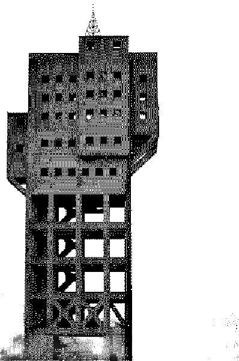

Här skriver [[jag]] saker om det som faller mig in och ibland ritar jag också. Jag vidhåller rätten att inte hålla mig till ämnet, inte sträva efter att bli viral eller göra något som skulle lämpa sig på linjära plattformar eller sociala medier. Här har jag full kontroll. Här kan jag till exempel skriva om [[treehouse|kojor]] eller [[businessmodels|affärsmodeller]] för att jag vill det.

Sidan är strukturerad som en [[varför-digital-garden|digital trädgård]], en samling noter, essäer och idéer i olika mognadsstadier sammanlänkade med hyperlänkar – en mystisk mutation av en blogg och en wiki.

Men vad betyder en mytoman i en lögndetektorfabrik? Det kanske jag skall förklara. Men inte nu.

Håll till godo

Ola

## Senaste

- [[treehouse|Varför finns det så ont bilder av kojor byggda av barn?]]
- [[businessmodels|Business model enshitification]]
- [[varför-digital-garden|Varför digital garden?]]
