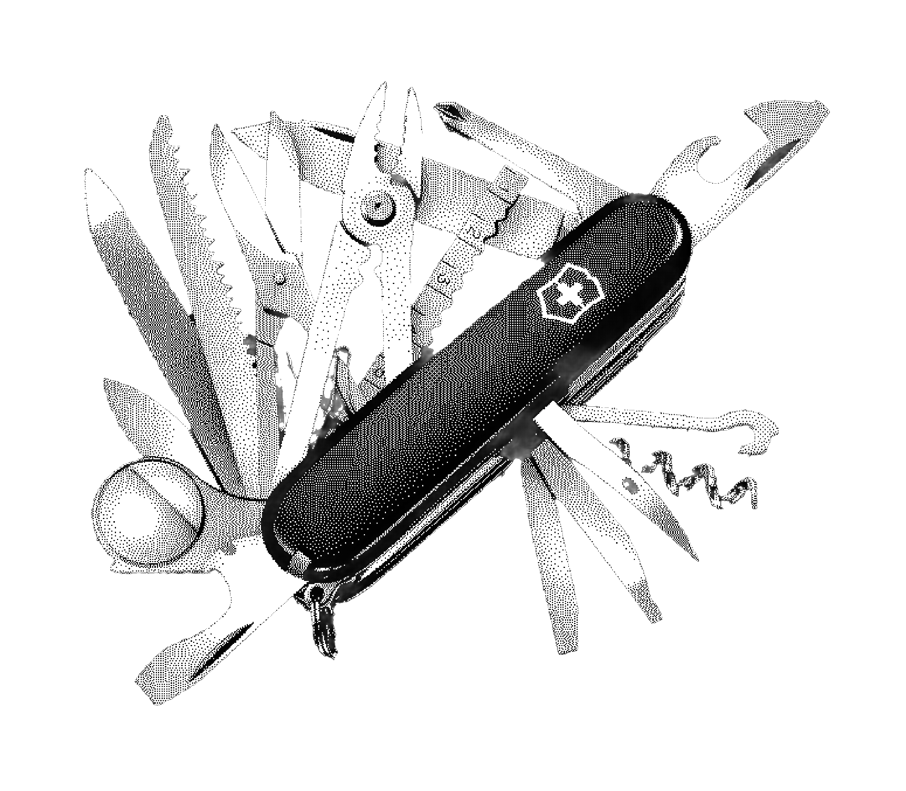

Jag är en schweizisk armékniv, brukar jag säga.

Eller det kanske inte är en perfekt beskrivning av vad jag är?

Hos en schweizisk armékniv är mångfalden dess främsta unika egenskap. Det enskilda verktyget är inte så imponerande men att klämma in alla i en och samma röda enhet är unikt. Och det är nog där jag känner att liknelsen haltar. Jag minns som barn hur irriterad jag var över hur detta röda multiverktyg inte gick att använda i mina träkojor – hur den lilla sågen som ingick var värdelös på att kapa grenar. Hur i stort sett varje verktyg var frustrerande dåligt jämfört med dess single purpose variant.

Nej, jag tror snarare att jag kanske skall beskriva mig som en verktygslåda. Men den bildliga metaforen har inte samma genomslag. Den är för generell. Men den får duga för nu. Men vad innehåller verktygslådan?

Pedagogik skulle jag vilja hävda är ett väl använt verktyg. Jag har jobbat från och till som lärare, främst inom yrkeshögskola men också på universitet och grundskola.

Designprocess och kreativa processer är något jag också spenderat många yrkesår med. Senast som creative director på SKF.

Speldesign. Jag har designat spel — digitala, brädspel och rollspel. Mer om det.

Tre verktyg. Det kanske inte var så imponerande. Men jag skriver mer senare.
