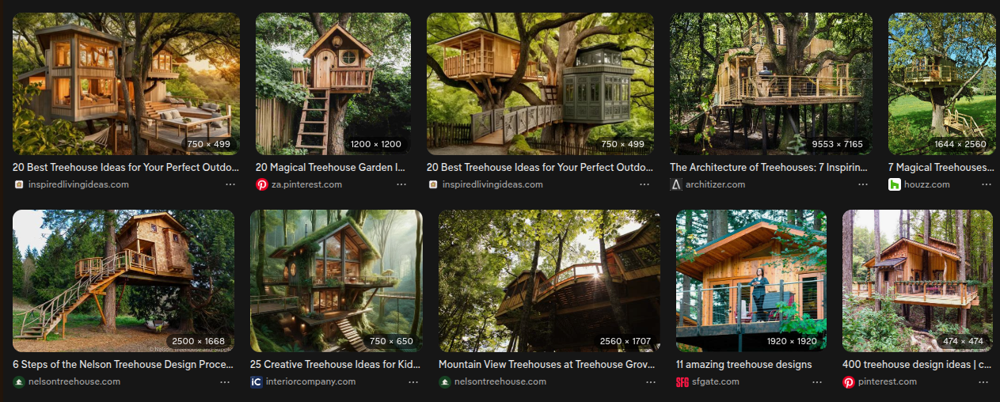
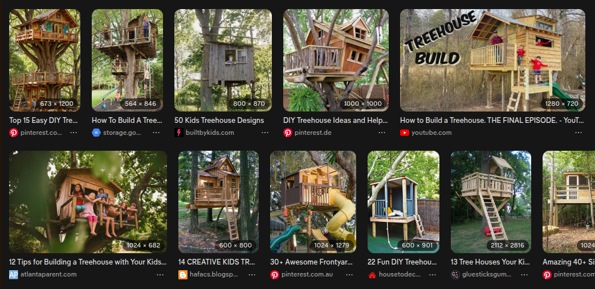

What do these treehouses have in common?

None of them were built by kids.

But let's change the search to "treehouse made by kids".

Yeah right. Not even the third example from the left has escaped the controlling fingers of adults. Too straight, too perfect.

But this isn't about whether or not adults let kids build treehouses (which maybe they do, maybe they don't), it's about why it's so damn hard to find images of them. I remember doing a search for this maybe ten years ago. My memory was that there were more pictures back then.

Consider that I'm sitting in front of my computer and kvetching. Like many other 50-something white men, I'd be working up some keyboard rage by blaming convenient modern phenomena like phones, games, movies, or whatever else. And sure, it's probably got something to do with kids spending less time outdoors these days. But still, it's not like they're never climbing in containers just to find planks to build dangerously precarious tree forts.

But I choose to think that it's part of enshitification – how image searches have become more streamlined. How algorithms push forward picture after picture of generic mush. So I'm directing my grumpy old man rage at that angle because I can't live with the thought that kids aren't building dangerously precarious treehouses anymore.

Note:
I did find some images eventually. A Flickr group called [Kids huts expedition](https://www.flickr.com/groups/kidhuts/) and one called [forgotten treehouses](https://www.flickr.com/groups/forgottentreehouses/). So maybe this story ends on a high note after all.
