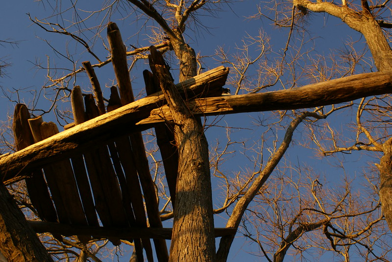

Vad har dessa kojor gemensamt? 

Ingen av dom är byggda av barn. 

Men låt oss ändra sökningen till "treehouse made by kids". 

Yeah right. Inte ens exemplaret tredje från vänster har den vuxne lyckats hålla sina kontrollerande fingrar i styr. Alldeles för rakt och tillrättalagt. 

Men detta handlar inte om att vuxna inte låter barn göra kojor (vilket kanske eller kanske inte är sant) utan varför det är så otroligt svårt att hitta bilder på det. Jag minns att jag gjorde en sökning för kanske tio år sedan. Mitt minne var då att det fanns fler bilder av barns kojor för tio år sedan. 

Betänk att jag sitter framför min dator och killgissar. Jag skulle som många andra +50 vita män arbeta upp lite tangentbordsvrede och skylla intilliggande moderna fenomen som telefoner, spel, film eller annan skit. Och visst har det säkert att göra med att barn i mindre utsträckning idag rör sig i skog och mark. Allt mer sällan springer i containrar bara för att hitta plankor att bygga livsfarliga träskapelser i träkronor. Ni vet dom där som är fullkomligt livsfarliga men så laddade med barns förväntan och skaparglädje.

Men jag väljer att tänka att det är en del av enshitification – hur sökningarna av bilder blivit mer strömlinjeformade. Hur algoritmer trycker fram bild efter bild med konformt snömos. Jag väljer att rikta min gubbvrede åt det hållet för jag kan inte leva med tanken på att barn inte längre bygger livsfarliga kojor i träd. 

Not: 
Jag hittade till slut bilder. En flickr-group som heter [Kids huts expidition](https://www.flickr.com/groups/kidhuts/) och en som heter [forgotten treehouses](https://www.flickr.com/groups/forgottentreehouses/). Så kanske slutar denna historia i dur. 
